# "ChapterHouse" Sistēmas Ceļvedis
----
## Ievads

"ChapterHouse" ir sistēma, kurā pievieno grāmatas no dotā kataloga katram lietotājam atsevišķā sarakstā. Sistēmas mērķis ir dot iespēju lietotājiem izveidot personīgu lasāmo grāmatu sarakstu, kuru ir iespējams filtrēt un kārtot pēc pieprasījuma, kā arī mainīt to lasīšanas statusu.

## Lietotāja Interfeisa Apraksts
----
### Galvenais Sākuma Logs

Šis ir sākuma izvēlnes logs, kurā ir iespejams reģistrēties, pieslēgties vai atslēgties no sistēmas.

### Sarakstu Izvēlnes Logs

Sarakstu izvēlnes logs pieejams lietotājam, kas pievienojies, un kurā izvēlas redzēt visas pieejamās grāmatas vai savu izveidoto grāmatu sarakstu.

### Kataloga Izvēlne
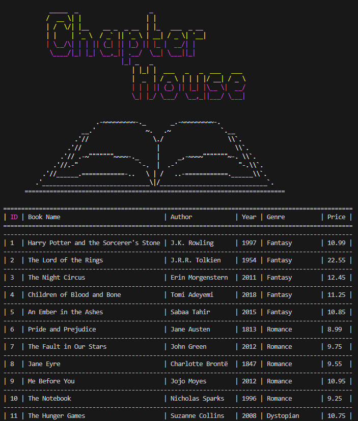

Dotās grāmatas ir iespējams kārtot, filtrēt, meklēt pēc lietotātja ievadītā, pievienot pie lietotāja personīgā saraksta vai iziet ārpus šīs izvēlnes.

### Lietotāja Saraksta Izvēlne

Šeit iespējams apskatīt lietotāja pievienotās grāmatas un izpildīt dažādas funkcijas, piemēram, kā kārtošana, meklēšana, filtrēšana, noņemšana, atiestatītšana (reset), mainīt statusu un atgriezties uz ieprikšējo logu.

## Funkciju Apraksti
----
### Pieslēgšanās
Katra izvēle veic dažādas pārbaudes, bet izskats un pieprasījumi ir līdzīgi.
#### 1. Ievada vienu no dotajām izvēlēm (login vai register).

#### 2. Ievada lietotājvārdu un e-pastu.

### Kārtošana
Tā ir pieejama gan katalogam, gan lietotāja sarakstam.
#### 1. Ievada pēc kuras kategorijas un virziena.

#### 2. Izmaiņas ir redzamas saraksta secībā, iekrāsotā virsraksta daļa un saraksta beigās pēc iezīmētā virziena.
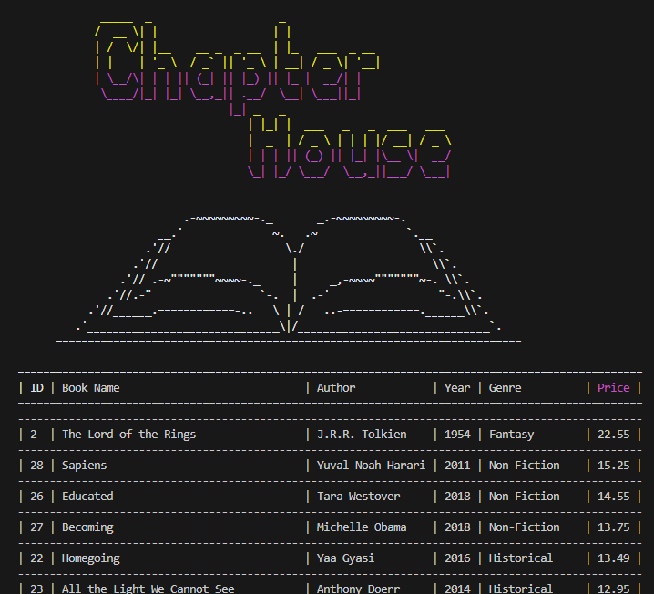

### Filtrēšana pēc žanra
Pieejams katalogam un lietotāja sarakstam.
#### 1. Izvēlas vai visi žanri tiek pievienoti, vai viens žanrs tiek noņemts vai pievienots. Šajā gadījumā noņems vienu.

#### 2. Izvēlas, kuru žanru.

#### 3. Izmaiņas ievērojamas gan pašā sarakstā, gan saraksta beigās, kur ir redzami aktīvie un neaktīvie žanri. Un tiek turpināta izvēle par filtrēšanu līdz lietotājs iziet.

### Grāmatas pievienošana sarakstam
Pieejams tikai katalogam.
#### 1. Lietotājam jāievada ID, kas ir pieejams.

#### 2. Atkarībā vai grāmata jau atrodas sarakstā tiek dota ziņa.

### Meklēšana
#### 1. Izvēlas kāda veida meklēšana.
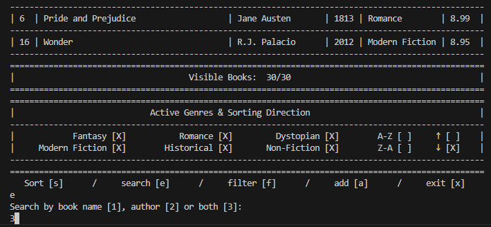
#### 2. Ievada meklējamo.

#### 3. Tālāk tiek dota izvēlne ar ko rikojas ar sameklētajām grāmatām.
##### Kataloga izvēlne pēc meklēšanas

##### Lietotāja saraksta izvēlne pēc meklēšanas
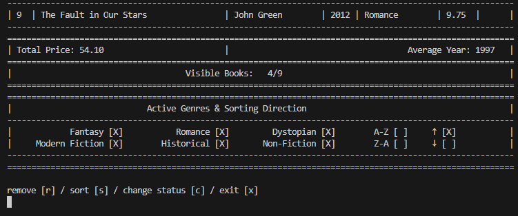

### Gramātu noņemšana no saraksta
#### 1. Lietotājam jāievada viens no pieejamajiem ID.
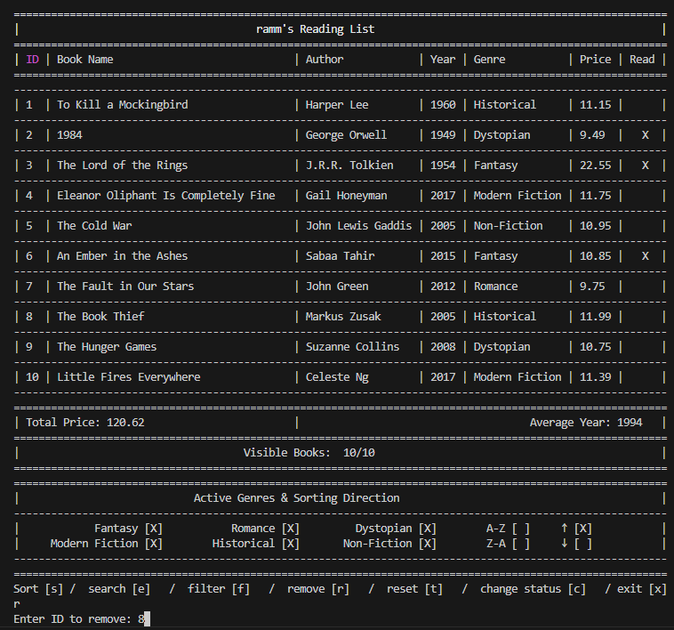
#### 2. Grāmata tiek noņemta no saraksta.
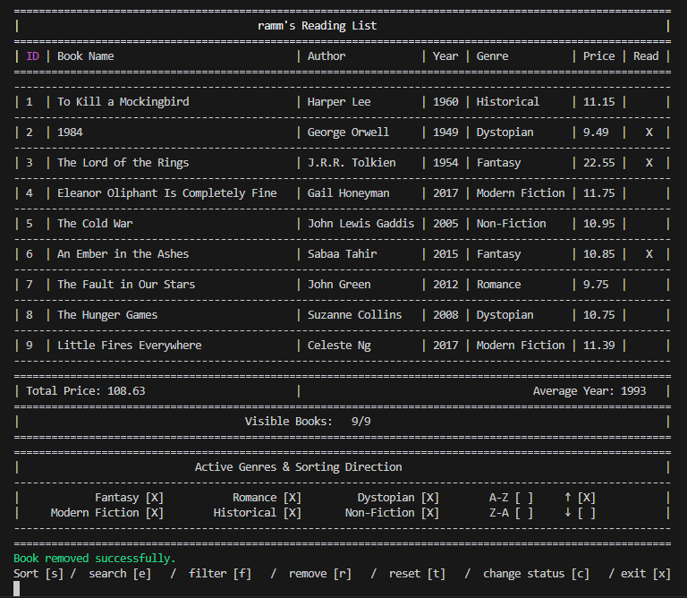

### Statusa mainīšana
Tikai lietotāja lasīšanas sarakstam.
#### 1. Lietotājam jāievada pieejams ID.
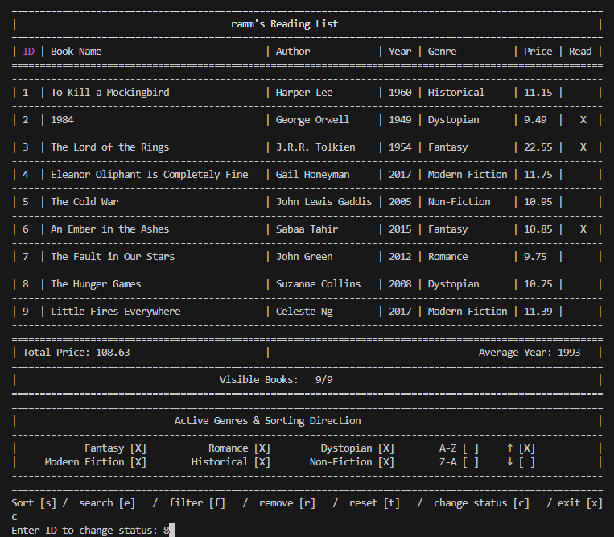
#### 2. Redzamās izmaiņas statusa marķējumos.
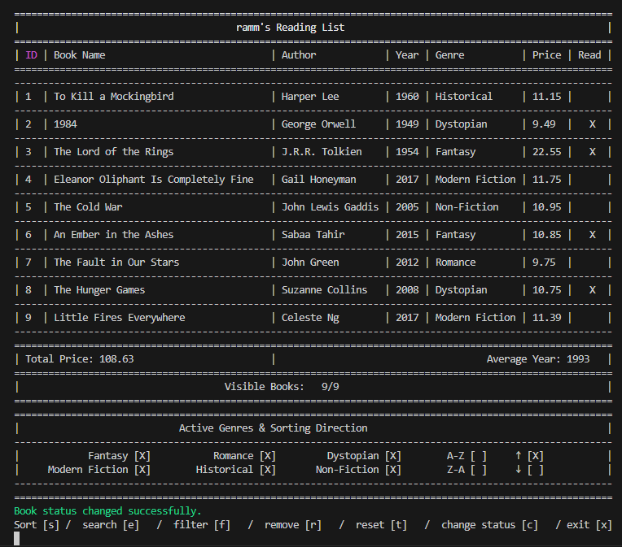

### Filtrēšana pēc statusa
Tikai lietotāja lasīšanas sarakstam.
#### 1. Izvēlas vai rādīt visas, vai tikai lasītās, vai tikai nelasītās
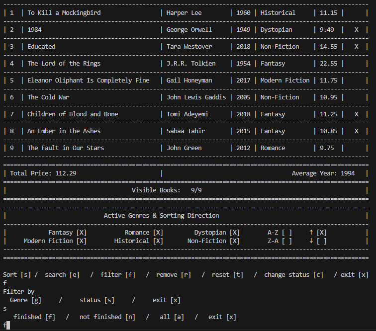
#### 2. Redzamas tikai izvēlētā statusa grāmatas.
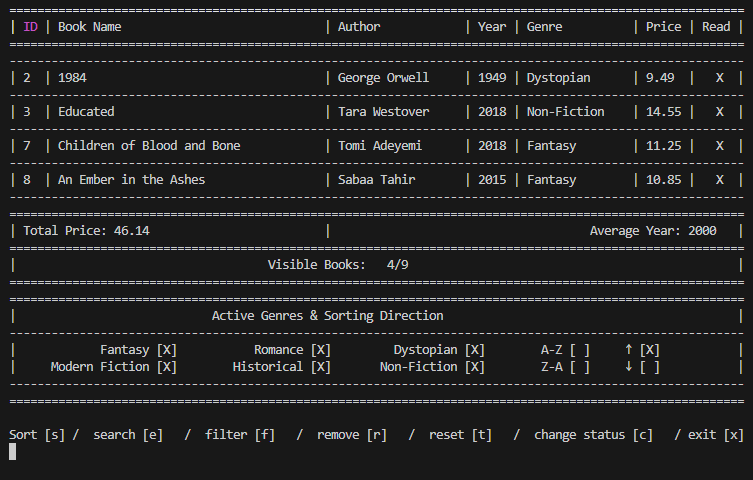

### Atiestatīšana (reset) - noņem visas filtrēšanas veidus un atgreiž kārtošanas veidu, kurš ir pēc noklušejuma
Tikai lietotāja lasīšanas sarakstam.
#### Pirms atiestatīšanas 
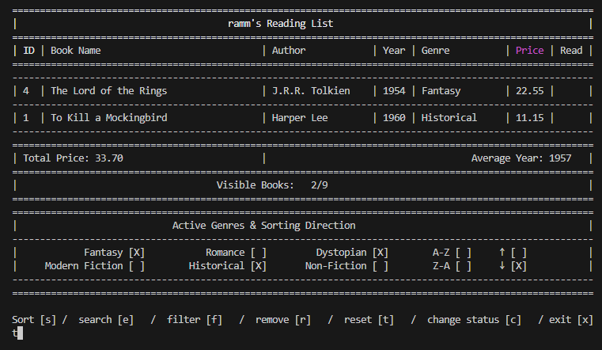
#### Pēc atiestatīšanas
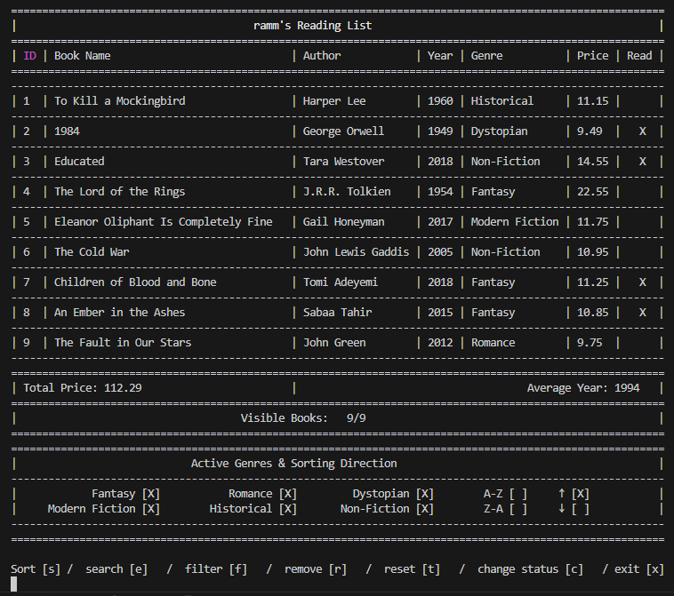